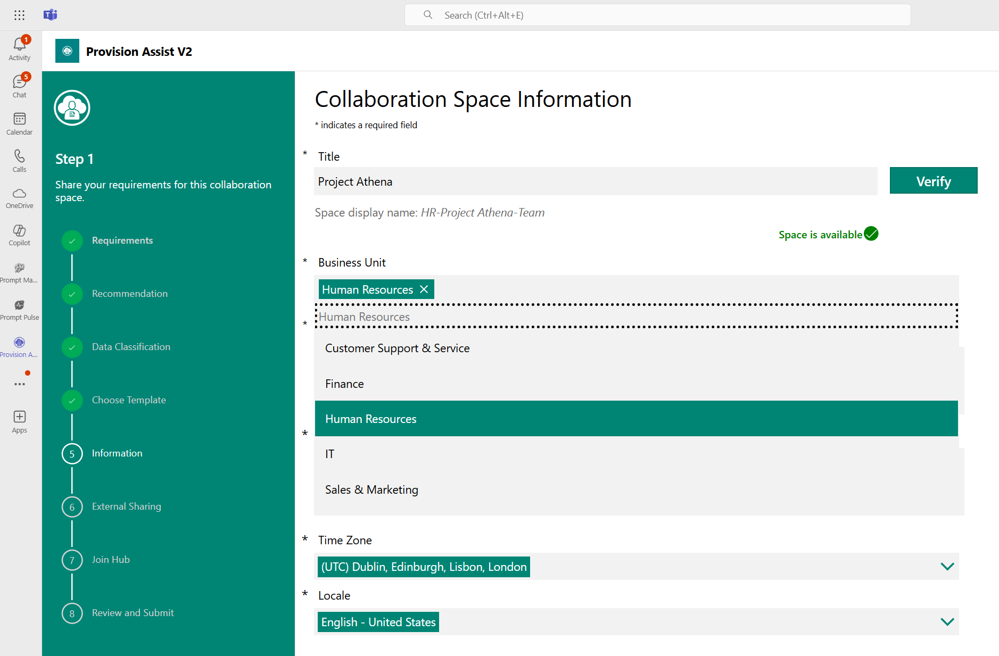
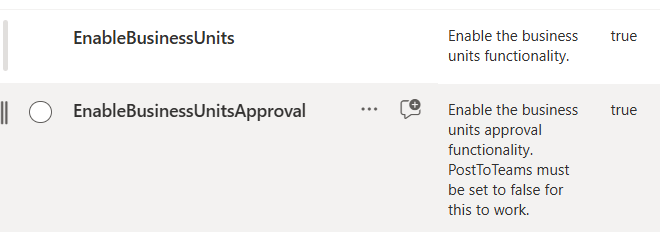
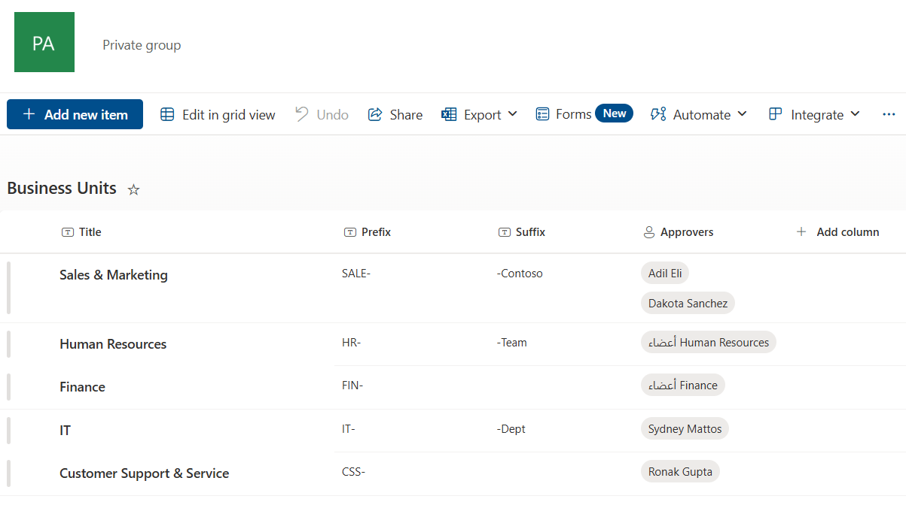

# Business Units

Provision Assist now includes the capability to define Naming Conventions/Policies and unique approvers for created spaces by 'Business Unit'.

When this functionality is enabled in the settings list, a user can select a business unit when making a request.

You can define a text 'Prefix' and 'Suffix' per business unit, for example you may wish to apply a prefix of HR- and a suffix of -Contoso for a 'Human Resources' business unit.

When a user makes a request through the Power App, the naming convention will be applied and a preview of how this will look when combined with the title they have entered will be shown (See 'Space display name' below). 

A lookup column in the 'Provisioning Requests' list stores the business unit that the user selected in the app.

If the setting to enable business units approvals is turned on in the settings list, approvals of requested spaces will use those approvers/groups defined in the 'Business Units' list based on the business unit selected when the user makes the request.

Please read on below to find out more about how to enable and configure this functionality.

This functionality builds on the existing [Naming conventions](/Naming-conventions.md) functionality so make sure you understand that first.

**Please note - If you are upgrading from an older version, before importing the Power Apps solution you will need to carry out some steps manually. Details of how to do this can be found at the bottom of this documentation.**

## Configuration

### Business Units Naming Convention

To enable this functionality, the value of the **'EnableBusinessUnits** setting in the 'Provisioning Request Settings' list MUST be set to 'true'. By default this will be set to 'false' after deployment.

In addition the value of the **UseNamingConventions** setting must be set to 'true' for the business units naming functionality to work.

### Business Units Approval

To enable this functionality, the value of the **'EnableBusinessUnitsApproval** setting in the 'Provisioning Request Settings' list MUST be set to 'true'. By default this will be set to 'false' after deployment. 

**Please note - For the business unit approval to work, the value of the **'PostToTeams'** setting must be set to 'false'.**

Approvers for business units are configured in the 'Business Units' list, multiple users or Microsoft 365 groups are supported.

**Business unit approval does not need to be enabled for the business units functionality to work, if disabled, approval will take place as normal.**

## Creating Business Units

To create a business unit, simply locate the 'Business Units' list in the Provision Assist SharePoint site and create a list item.

Populate the columns as follows:

**Title**: Title of the business unit e.g. Human Resources

**Prefix**: Desired prefix e.g. HR-

**Suffix**: Desired suffix e.g. -Contoso

**Approvers**: Approvers who should approve the request.

## Limitations

In this initial release there are some limitations to be aware of.  

- Business unit naming conventions cannot be used in conjunction with 'Global', 'Space' or 'Teams Template' naming conventions. If business unit naming conventions are enabled, this will override any other configured naming convention.
- Only text based prefixes and suffixes are supported, the ability to use properties such as the users' department is not yet available.
- A business unit must be selected in the app if the functionality is enabled.

## Upgrading from an earlier version (Adding business units functionality)

**Before** importing the updated Provision Assist Power Apps solution, follow the steps below to add the Business Units functionality.

1. Create a list named 'BusinessUnits', once created rename the list to 'Business Units' i.e. add a space.
2. Create the following columns:

- Prefix (Single line of text)
- Suffix (Single line of text)
- Approvers (Person or Group - Allow multiple selections)

3. Locate and navigate to the 'Provisioning Requests' list.
4. Add a new column:

- Business Unit (Lookup - Business Units, Title column)

5. Open the [SharePoint List Items](./Source/Settings/SharePoint%20List%20items.xlsx) spreadsheet.

6. In the 'Provisioning Request Settings' worksheet locate the business units settings and create the relevant items in the settings list copying and pasting the Title, Value and Description.

7. Import the latest Provision Assist Power Apps solution (this will upgrade earlier versions), making sure to select the 'Business Units' list when importing. 

